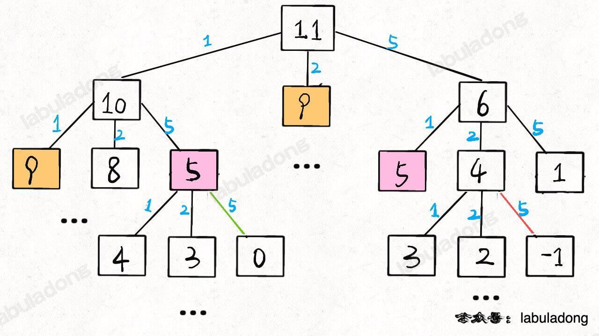
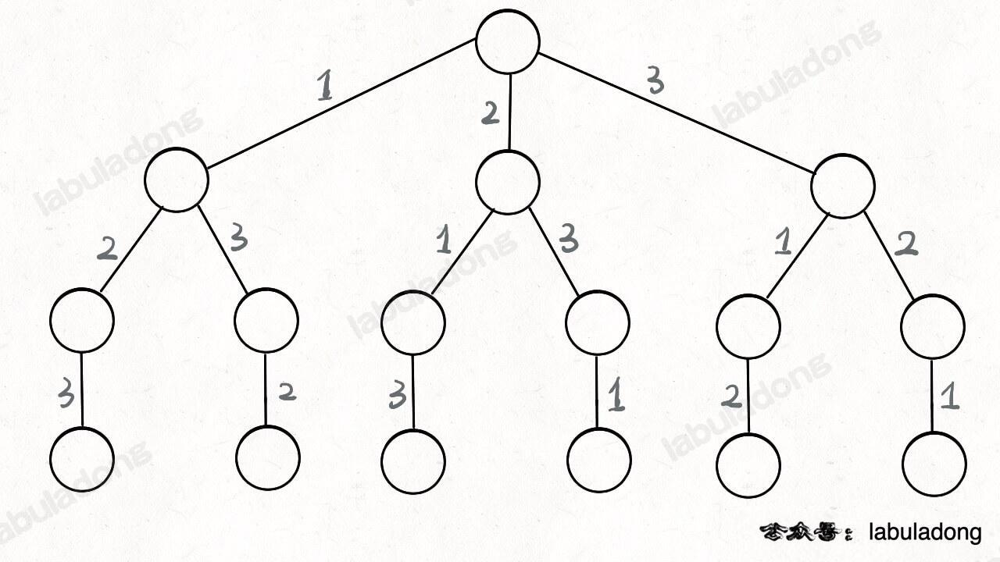

### 数据结构的存储方式

**数据结构的存储方式只有两种：数组（顺序存储）和链表（链式存储）**  
分析问题：要有递归的思想--自顶向下  

**底层结构**：上层建组均可由底层结构实现，数组和链表  
**上层建筑**：散列表、栈、队列、堆、树、图等

1. 栈和队列
   * 数组实现：扩容缩容问题
   * 链表实现：内存空间问题
2. 图
   * 邻接表（链表实现）。邻接表比较节省空间，但是很多操作的效率上肯定比不过邻接矩阵。
   * 邻接矩阵（二维数组）。邻接矩阵判断连通性迅速，并可以进行矩阵运算解决一些问题，但是如果图比较稀疏的话很耗费空间。
3. 散列表：通过散列函数把键映射到一个大数组中。
   * 线性探查法就需要数组特性，以便连续寻址，不需要指针的存储空间，但操作稍微复杂些。
   * 对于解决散列冲突的方法，拉链法需要链表特性，操作简单，但需要额外的空间存储指针。
4. 树
   * 用数组实现就是「堆」，「堆」是一个完全二叉树，用数组存储不需要节点指针，操作也比较简单。
   * 用链表实现就是很常见的那种「树」，因为不一定是完全二叉树，所以不适合用数组存储。为此，在这种链表「树」结构之上，又衍生出各种巧妙的设计，比如二叉搜索树、AVL 树、红黑树、区间树、B 树等等，以应对不同的问题。

综上，数据结构种类很多，甚至你也可以发明自己的数据结构，但是底层存储无非数组或者链表。  

**数组与链表的优缺点**  

**数组**由于是紧凑连续存储，可以随机访问，通过索引快速找到对应元素，而且相对节约存储空间。但正因为连续存储，内存空间必须一次性分配够，所以说数组如果要扩容，需要重新分配一块更大的空间，再把数据全部复制过去，时间复杂度 O(N)；而且你如果想在数组中间进行插入和删除，每次必须搬移后面的所有数据以保持连续，时间复杂度 O(N)。  
**链表**因为元素不连续，而是靠指针指向下一个元素的位置，所以不存在数组的扩容问题；如果知道某一元素的前驱和后驱，操作指针即可删除该元素或者插入新元素，时间复杂度 O(1)。但是正因为存储空间不连续，你无法根据一个索引算出对应元素的地址，所以不能随机访问；而且由于每个元素必须存储指向前后元素位置的指针，会消耗相对更多的储存空间。

### 数据结构的基本操作

**基本操作**：遍历+访问（增删改查）  
**存在意义**：在不同的应用场景，尽可能高效地增删查改  
**遍历+访问**：线性、非线性

1. 典型线性结构： for/while 迭代
2. 典型非线性结构：递归
* 数组遍历：线性迭代
* 链表遍历：迭代+递归
  ```C++
    /* 基本的单链表节点 */
    class ListNode {
    public:
        int val;
        ListNode* next;
    };

    void traverse(ListNode* head) {
        for (ListNode* p = head; p != nullptr; p = p->next) {
        // 迭代访问 p->val
        }
    }

    void traverse(ListNode* head) {
        // 递归访问 head->val
        traverse(head->next);
    }
  ```
* 二叉树：非线性递归
  ```C++
    /* 基本的二叉树节点 */
    struct TreeNode {
        int val;
        TreeNode* left;
        TreeNode* right;
    };

    void traverse(TreeNode* root) {
        traverse(root->left);
        traverse(root->right);
    }
  ```
* N叉树与二叉树类似
  ```C++
    /* 基本的 N 叉树节点 */
    class TreeNode {
    public:
        int val;
        vector<TreeNode*> children;
    };

    void traverse(TreeNode* root) {
        for (TreeNode* child : root->children)
            traverse(child);
    }
  ```
* 图的遍历：多个N叉棵树的结合体；图是可能出现环的，用个布尔数组visited做标记就行了。

### 算法刷题指南

数据结构是工具，算法是通过合适的工具解决特定问题的方法。  

**建议的刷题顺序**

1. 先学习像数组、链表这种基本数据结构的常用算法，比如单链表翻转，前缀和数组，二分搜索等。
2. 学会基础算法之后，不要急着上来就刷回溯算法、动态规划这类笔试常考题，而应该先刷二叉树

为什么要先刷二叉树呢，因为二叉树是最容易培养框架思维的，而且大部分算法技巧，本质上都是树的遍历问题。  

**二叉树框架**
```C++
void traverse(TreeNode* root) {
    // 前序位置
    traverse(root->left);
    // 中序位置
    traverse(root->right);
    // 后序位置
}
```
1. 力扣第 124 题，难度困难，让你求二叉树中最大路径和
   ```C++
    int res = INT_MIN;
    int oneSideMax(TreeNode* root) {
        if (root == nullptr) return 0;
        int left = max(0, oneSideMax(root->left));
        int right = max(0, oneSideMax(root->right));
        // 后序位置
        res = max(res, left + right + root->val);
        return max(left, right) + root->val;
    }
   ```
   后序遍历

2. 力扣第 105 题，难度中等，根据前序遍历和中序遍历的结果还原一棵二叉树
   ```C++
    TreeNode* build(vector<int>& preorder, int preStart, int preEnd, 
                    vector<int>& inorder, int inStart, int inEnd) {
        // 前序位置，寻找左右子树的索引
        if (preStart > preEnd) {
            return nullptr;
        }
        int rootVal = preorder[preStart];
        int index = 0;
        for (int i = inStart; i <= inEnd; i++) {
            if (inorder[i] == rootVal) {
                index = i;
                break;
            }
        }
        int leftSize = index - inStart;
        TreeNode* root = new TreeNode(rootVal);

        // 递归构造左右子树
        root->left = build(preorder, preStart + 1, preStart + leftSize,
                        inorder, inStart, index - 1);
        root->right = build(preorder, preStart + leftSize + 1, preEnd,
                        inorder, index + 1, inEnd);
        return root;
    }
   ```
   参数很多，只是为了控制数组索引。需要注意递归函数build的位置，本质上该算法也就是一个前序遍历，因为它在前序遍历的位置加了代码逻辑。

3. 力扣第 230 题，难度中等，寻找二叉搜索树中的第`k`小的元素
   ```C++
    int res = 0;
    int rank = 0;
    void traverse(TreeNode* root, int k) {
        if (root == nullptr) {
            return;
        }
        traverse(root->left, k);
        /* 中序遍历代码位置 */
        rank++;
        if (k == rank) {
            res = root->val;
            return;
        }

        traverse(root->right, k);
    }
   ```
   中序遍历，对于一棵`BST`中序遍历意味着什么?

4. 动态规划详解说过凑零钱问题，暴力解法就是遍历一棵 N 叉树
   
   
   

   ```C++
    int dp(vector<int>& coins, int amount) {
        // base case
        if (amount == 0) return 0;
        if (amount < 0) return -1;

        int res = INT_MAX;
        for (int coin : coins) {
            int subProblem = dp(coins, amount - coin);
            // 子问题无解则跳过
            if (subProblem == -1) continue;
            // 在子问题中选择最优解，然后加一
            res = min(res, subProblem + 1);
        }
        return res == INT_MAX ? -1 : res;
    }
   ```
   直接提取出框架，就能看出核心思路了：

   ```C++
    int dp(int amount) {
        // 不过是一个 N 叉树的遍历问题而已
        for (int coin : coins) {
            dp(amount - coin);
        }
    }
   ```
   很多动态规划问题就是在遍历一棵树，需要对树的遍历操作烂熟于心，知道怎么把思路转化成代码，也知道如何提取别人解法的核心思路。

5. 回溯算法就是个N叉树的前后序遍历问题，没有例外。
   
   到叶子节点的路径就是一个全排列：

   [//] # ()
   

   ```C++
    void backtrack(vector<int>& nums, list<int>& track, vector<list<int>>& res) {
        if (track.size() == nums.size()) {
            res.push_back(list<int>(track.begin(), track.end()));
            return;
        }
        
        for (int i = 0; i < nums.size(); i++) {
            if (find(track.begin(), track.end(), nums[i]) != track.end())
                continue;
            track.push_back(nums[i]);
            // 进入下一层决策树
            backtrack(nums, track, res);
            track.pop_back();
        }
    }
   ```
   把其中的递归部分抽取出来：

   ```C++
    // 提取出 N 叉树遍历框架 
    void backtrack(vector<int>& nums, vector<int>& track) {
        for (int i = 0; i < nums.size(); i++) {
            backtrack(nums, track);
        }
    }
   ```

**试着从框架上看问题，而不要纠结于细节问题。**